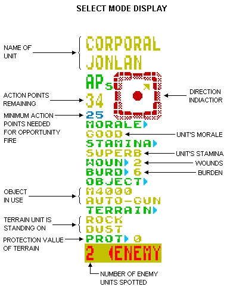
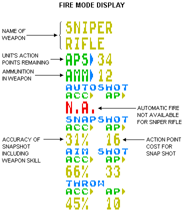


# LASER SQUAD PLAYERS MANUAL

## INTRODUCTION

Laser Squad is a one or two player tactical wartime system that accurately simulates many aspects of individual level combat. It will take some time for a new player to become familiar with all aspects of the system, and we recommend that you load the program and go through the first section of this manual which provides you with a basic guide to playing the game. The second section should be treated as a reference manual for experienced players. The final section in this booklet provides instructions for the seven scenarios provided with the main program.

### LOADING THE GAME

Laser Squad is always loaded in two sections. The main program should load with the web page. When this has loaded you must select which scenario you wish to play.

### GAME CONTROLS

Once the game has loaded you must select the keyboard layout you require. You can re-define the control keys. The following keys are the default:

	Q	=UP
	A	=DOWN
	O	=LEFT
	P	=RIGHT
	SPACE BAR	=FIRE

---

## PART ONE: PLAYING THE GAME

### OVERVIEW

Laser Squad is played in a series of game turns. Each player, during his turn, controls a small number of units which represent humans, droids or other creatures. Each unit has its own individual name and characteristics which affect the abilities and activity of that unit. At the start of each game turn each, unit is allocated a number of Action Points (or APs) which are used for performing all activities of that unit such as movement, combat, manipulating objects etc. Once all action points are used for each unit, or the player does not wish to use any more, the 'end turn' option is selected and the other player (or the computer) takes his turn. The winner of the game is the first side to accumulate 100 victory points. Victory points are awarded for various things, such as eliminating enemy units or destroying certain installations, depending on the scenario being played.

### GAME SET UP

You will be asked whether you want a one player game or a two player game. If you select the one player option the computer will take control of the second side. You will then be asked what level you wish to play at. The number of levels varies between scenarios and the higher the level the more difficult the computer is to beat. If you are playing with two players then only the player whose turn it is should be allowed to see the screen.

Each player now selects equipment and deploys his units.

### EQUIPMENT SELECTION

In each scenario you are allocated a number of Credits to spend on armour, weapons and ammunition. The first thing you must do is select armour for each unit. Your units are displayed on the left of the screen and you select armour for each unit in sequence. Use the UP and DOWN controls to select the unit, the RIGHT and LEFT controls to select the type of armour and press FIRE when you are satisfied with your choice. If you select '0' then the unit will have no armour. If you select a number from one to four then the unit will be given an armour type according to the specifications displayed in the table on the right of the screen. A full explanation of armour is included in the reference section.

After you have allocated armour to each unit you then select equipment. Initially the object selector is highlighted. Use the RIGHT and LEFT controls to change the object currently selected. Each object's unique graphics symbol and name is displayed together with the cost of purchasing the object. In order to allocate objects to a unit use the UP and DOWN controls to highlight the unit you require and then use RIGHT to add the currently selected object to that unit's equipment, or LEFT to subtract the object. You cannot give an object to a unit if you have insufficient credits, or if that unit's weight or size limits would be exceeded. Once you are satisfied with your selection press FIRE twice to continue the game.

All weapons are loaded with ammunition when purchased, but extra ammunition for each weapon is available. Consult the weapons table in the reference section for details on weapons and ammunition.

I have added the option to go back from the equipment selection screen back to the armour selection screen. There's a button in the on-screen controls for this, or use the pop-up menu and choose the "Back to Armour" option

### DEPLOYMENT

Each unit is deployed in turn until all units have been placed on the map. The deployment mode shows the name and equipment of the unit to be deployed on the right of the screen and the map window on the left. Use UP, DOWN, LEFT and RIGHT to move the flashing white cursor around the map until you have found the deployment square you want. Each scenario will specify which spaces you can deploy on. Place the cursor over the deployment square and press FIRE to deploy the unit.

### GAME OPTIONS

Before each game turn starts you will be presented with a menu which allows you to save and load games. Press the number of the option you require or press fire to continue with the game.

**_CHANGE CONTROLS_**: 	Allows you to change the controls of the game by re-defining the keys.

**_SAVE GAME_**: 	Allows you to save the current game. As Laser Squad is running in your browser, the only safe way to save a game is to treat it as a download. It sugests a name based on the scenario, and the current time & date which you can change.

**_LOAD GAME_**: 	If you select this option, then the current game is abandoned in order to load a new game. You will be presented with the same menu that appears when the main program is first loaded.

**_VERIFY GAME_**:	If you have just saved the current game to tape then use this option to make sure that it has saved properly.

### CURSOR MODE

At any time the game is in one of three different modes; cursor mode, select mode or fire mode. Each game turn starts in cursor mode which simply allows you to move the cursor around the map using UP, DOWN, LEFT and RIGHT. The display on the right of the screen shows information about the map space under the cursor as follows:

- **MAP**: 	The name of the terrain feature such as grass, floor, wall etc.
- **OBJECT**: 	The name of any object on the ground.
- **UNIT**: 	The name of any unit under the cursor.
- **OBJECT IN USE**: 	The object that the unit is currently using, if any.

### CURSOR MODE OPTIONS

Laser Squad is controlled via a series of menus which are simply lists of different options available to you at any time. To display a menu, which ever mode you are in, press FIRE. Use UP and DOWN to highlight the option of your choice and press FIRE to select the option. You can also tap or click on a menu option to select it also. The options that can be available in cursor mode are as follows:

**_SELECT_**: 	If the cursor is placed over one of your units with APs remaining then you will be able to select that unit for movement and other actions. Once you select this option you will enter select mode.

**_INFO_**: 	If the cursor is placed over any unit then information on that unit can be displayed.

**_NEXT UNIT_**: 	This option simply moves the cursor to another friendly unit with APs remaining.

**_SCANNER_**: 	A strategic map of the entire playing area can be displayed showing the positions of all your units and any enemy unitsthat are currently spotted. In scenarios with a map larger than 80 by 50, arrows will appear around the scanner display. Click on these with your mouse to move the scanner display around the map. Alternatively use UP, DOWN, LEFT, or RIGHT to move the view.

**_CANCEL_**: 	The cancel option in each menu just clears the menu and returns you to the current mode.

### SELECT MODE

Fig.1

In Select mode the message display on the right of the screen shows essential information about the unit you have selected (see fig. 1). Most important is the number of Action Points remaining and the direction indicator which shows which direction the unit is facing. Once you have selected a unit then the directional controls are used to move the unit as follows:

- **_LEFT_**: 	Rotate unit left
- **_RIGHT_**: 	Rotate unit right
- **_UP_**: 	Move unit forwards in the direction that it is facing
- **_DOWN_**: 	Move unit backwards

### MOVEMENT

Moving a unit will always cost Action Points, depending on the terrain that is being moved over. Moving diagonally will cost an extra two APs and rotating a unit 45° costs one AP. If you attempt to move into impassable terrain the unit will attack the terrain and possibly destroy it.

You are allowed to move the selected unit over friendly units but you can never end movement on top of a friendly unit. The only options available to a unit on top of another are to continue moving or to select the END MOVE option from the menu. If you select the END MOVE option then the unit will be placed on the last empty space that it occupied.

### CLOSE COMBAT

In order to engage in close combat simply move your unit into an enemy unit. The close combat display on the right will show you what weapon the unit is using (if any), the accuracy (% chance to hit), the AP cost, the damage and the hit location.

### LINE OF SIGHT

Laser Squad uses a hidden movement system which means that enemy units will not appear on the map unless they are in the field of vision of one of your units. A unit's field of vision extends 45° from the front. Various types of terrain such as walls or doors will block line of sight. You will not see an enemy unit until it is clearly in view.

### SELECT MODE OPTIONS

When you press FIRE in select mode you will have a variety of menu options depending on the circumstances of the unit. Most of these options cost APs based on a percentage of the units Action Point Allowance. For example if a unit is allocated 50 APs at the beginning of the turn then changing an object costs 20% of its AP allowance which is 10 APs. Actions cannot be carried out if the unit has insufficient APs (although the option is still included in the menu list).

The following menu options are available in select mode:

**_END MOVE_**: 	Ends the selection of the unit and returns to cursor mode. The unit can still be re-selected provided it still has APs remaining.

**_FIRE_**: 	If the unit has an object in use then it can be fired or thrown. Selecting this option changes the display to fire mode.

**_CHANGE_**: 	If the unit is carrying one or more objects then this option is used to select an object for use or to change the object in use. The unit's objects are displayed on the screen with the ammunition amount, weight and size of each object. The white pointer on the left shows which object is currently in use, if any. Use the UP and DOWN controls to move the pointer to the object you want to use and press FIRE to change object. Performing this action costs 25% of the units Action Point allowance.

**_PICK UP_**: 	If the unit is standing on a space with one or more objects on the floor then they can be picked up. This option displays all the objects in the space in a similar manner to the change object display. Use the UP and DOWN controls to move the pointer to the object you want to pick up and press FIRE to implement the action. If you don't want to pick up any objects move the pointer to CANCEL and press fire. This option costs 50% if the unit has an object in use or 25% if it does not.

**_DROP_**: 	If the unit has an object in use then it can be dropped costing 10% of its AP allowance. It is possible to hide an object that is dropped, depending on the size of the object and the capacity of the terrain the unit is standing on. For example you can hide a grenade in a plant pot but not a rifle, you cannot hide anything on a floor space but you can hide most things under a bed. If it is possible to hide the dropped object then a small menu is displayed asking you whether you wish to hide the object or not.

**_LOAD_**: 	If the unit has a ranged combat weapon in use and it is also carrying the appropiate ammunition for that weapon then it can be loaded with new ammunition costing 50% of the unit's AP allowance.

**_PRIME_**: 	If the unit has a grenade in use which is not primed then it can be primed at a cost of 20%. Use the UP and DOWN controls to alter the timer and press FIRE to prime the grenade. The value of the timer determines when the grenade will explode. If the timer is set to 0 then it will explode at the end of your turn. If it is set to 1 then it will go off at the end of the next team's turn, and if it is set to 2 then it will go off at the end of the team after the next team's turn (in a two player game this is your team), and so on.

**_OPEN_**: 	If the unit is facing towards a closed, unlocked door then it can be opened. The cost is 20% of AP allowance.

**_CLOSE_**: 	If the unit is facing towards an opened door it can be closed. The cost is 20% of AP allowance.

**_UNLOCK_**: 	If the unit is facing towards a locked door and it is using the correct key then the door can be unlocked. The cost is 25% of AP allowance.

**_LOCK_**: 	If the unit is facing towards an unlocked door and it is using the correct key then the door can be locked. The cost is 25% of AP allowance.

**_SCANNER_**: 	The strategic map can be displayed with no AP cost.

**_CANCEL_**: 	Clear menu and return to movement.

### FIRE MODE

Fig.2

When you select the FIRE option the main display will change from a perspective map to a Line of Fire map which shows all the terrain that blocks shooting or throwing. All units are replaced with a blob depicting the target area of each unit. The square cursor is replaced by a flashing cross-hair cursor for targeting shots. The information display on the right shows the weapon being used and the essential information for ranged combat (see fig. 2). In order to fire a weapon move the cross-hair cursor to the desired target point, press FIRE to display the fire mode menu and select the type of shot you require. You will not be able to fire a shot if the cursor is outside the unit's field of vision.

### FIRE MODE OPTIONS

Only ranged combat weapons will have the three fire options for automatic fire, snap shots and aimed shots. Some weapons are unable to do automatic fire. If the unit is using any other object then only the throw option will be available.

The following options are available in Fire Mode:

**_AUTO_**: 	Automatic fire is a burst of continuous fire between two specified points. A minimum of three shots must be fired and the unit must have enough APs for at least three auto-shots in order to select this option. Once you have selected automatic fire you must select a second target point within the unit's field of vision. Press FIRE when you have moved the cursor to the desired point. You will then be asked to select the number of shots you wish to fire from three up to the maximum allowed by the unit's Action Points. Use the UP and DOWN controls to change the number of shots and press FIRE to execute the shots.

**_SNAP_**: 	A snap shot is a single shot, but is more accurate than automatic fire.

**_AIM_**: 	An aimed shot is the most accurate type of shot but requires the most Action Points.

**_THROW_**: 	Any object can be thrown up to a distance determined by the unit's strength divided by the object's weight. An object will never be thrown further than the cursor which allows for fairly accurate placing of objects. The accuracy of throwing is equivalent to the unit's agility rating and the cost is 20% of the unit's AP allowance. If a thrown object hits another unit then the object can be caught provided the unit is facing the thrower and has no object currently in use. If the object is not caught then it will fall at the unit's feet.

**_INFO_**: 	If the cursor is over a unit then information on that unit can be displayed.

**_END FIRE_**: 	Ends fire mode and returns to select mode.

**_CANCEL_**: 	Clears menu.

### OPPORTUNITY FIRE

Opportunity fire is an essential feature of the tactics employed in Laser Squad. If a unit is left with at least half its Action Point Allowance at the end of the game turn then it will be elegible for opportunity fire. During your opponents turn opportunity fire will be triggered when an enemy unit moves into the field of vision of your unit. Control will switch to you in fire mode which allows you to shoot the enemy unit. Once you select the END FIRE option then your opponent can continue with his turn.

---

## PART TWO: REFERENCE GUIDE

### UNIT CHARACTERISTICS

Each unit has a unique set of attributes which affect the game in various ways.

**_MORALE VALUE_**: 	Each unit's morale value represents the value of the unit to the rest of its squad. If the unit is eliminated then the morale of all units on its side will decrease by an amount equal to its morale value and all enemy units morale will increase by the same value.

**_MOVEMENT TYPE_**: 	Different types of unit have different AP costs for certain types of terrain. For example the droids in scenario one are unable to trample over the household furniture.

**_ACTION POINT ALLOWANCE_**: 	This represents the number of Action Points that the unit is allocated at the start of each turn. However, a unit's initial AP allowance is modified by a number of factors. The weight of the unit's armour and the unit's burden are both subtracted from this value.

**_CONSTITUTION_**: 	A unit's constitution is the amount of damage it can take before it is eliminated.

**_WOUNDS_**: 	If a unit's constitution is reduced then the unit will receive a number of wounds which are subtracted from the unit's Action Points at the start of each turn.

**_WOUND RATE_**: 	The wound rate is the number of constitution points lost needed to generate one wound.

**_STAMINA_**: 	This value represents the physical fitness, or energy, of the unit. If a unit spends more than half its APs on energetic tasks like movement then stamina will be reduced. Unused APs will help recover stamina. If Stamina reaches such a low level that the unit is feeble then it will only receive half its AP allowance at the start of each turn until stamina is recovered through rest.

**_MORALE_**: 	A unit's morale is adversely affected if friendly units are eliminated or if a unit is wounded. Morale will increase (but not beyond initial morale) if enemy units are eliminated. If a unit becomes panicked then it may drop objects that it is using. The morale of droids is never reduced.

**_WEAPON SKILL_**: 	This value affects ranged combat only. Combined with the skill factor of a weapon the accuracy of firing can be increased.

**_STRENGTH_**: 	The weight of objects that can be carried is determined by a unit's strength. In close combat strength can increase the damage done by a weapon.

**_AGILITY_**: 	The accuracy of throwing depends on a unit's agility. The accuracy of hitting in close combat is affected by the attacking unit's agility and the defending unit's agility.

**_UNARMED COMBAT_**: 	This represents the unit's innate abilty at close combat without using any weapon.

**_BURDEN_**: 	A unit's burden is subtracted from its AP allowance. The burden value is calculated according to the strength of the unit and the total weight of all objects carried.

**_ARMOUR_**: 	Each unit has an armour rating for its front side, left side, right side and rear. The unit's directional facing and the source of each shot is used to calculate which armour rating is used in combat calculations. Armour can be damaged if a damage value from a shot or hit is greater than the armour rating. A unit's constitution will only be affected by a damage value which is greater than the armour value.

**_VICTORY POINTS_**: 	A unit's victory point value is added to the enemies total victory points when the unit is eliminated.

### WEAPONS AND OBJECTS

There are three basic categories of objects in Laser Squad, weapons, ammunition and other objects. There are three types of weapon, close combat weapons, ranged weapons and grenade type weapons. Most ranged weapons can be used in close combat. Objects can have some or all of the following characteristics:

**_WEIGHT_**: 	All objects have a weight value.

**_SIZE_**: 	All objects have a size value. Units are limited in the total size of objects that they can carry depending on the type of armour worn. When there is more than one object in a space then the largest object is displayed on the map.

**_CONSTITUTION_**: 	All objects have a constitution value which represents the damage factor needed to destroy the object.

**_ACTION POINT COST_**: 	When an object is on the ground there can be an AP cost for moving onto it in addition to the AP cost for the terrain.

**_CLOSE COMBAT COST_**: 	The percentage of APs required to use the weapon in close combat.

**_CLOSE COMBAT ACCURACY_**: 	The basic chance of hitting with the weapon. This is modified by a number of factors in close combat.

**_CLOSE COMBAT DAMAGE_**: 	The average amount of damage points inflicted by the weapon in close combat.

**_CLOSE COMBAT STRENGTH BONUS_**: 	The percentage of a unit's strength that is added to damage in close combat.

**_CLOSE COMBAT AGILITY BONUS_**: 	The percentage of a unit's agility that is added to the accuracy in close combat.

**_AUTOMATIC FIRE AP COST_**: 	The percentage of a unit's action point allowance used for a single automatic shot.

**_AUTOMATIC FIRE ACCURACY_**: 	The percentage chance of being on target.

**_SNAP SHOT AP COST_**: 	The percentage of unit's action point allowance used for a single snap shot.

**_SNAP SHOT ACCURACY_**: 	The percentage chance of being on target with a snap shot.

**_AIMED SHOT AP COST_**: 	The percentage of unit's action point allowance used for one aimed shot.

**_AIMED SHOT ACCURACY_**: 	The percentage chance of being on target with an aimed shot.

**_SKILL FACTOR_**: 	This value determines how much of a unit's weapon skill is added to accuracy in ranged combat.

**_RANGED COMBAT DAMAGE_**: 	The average amount of damage inflicted by the weapon in ranged combat. If the weapon has explosive ammunition, or if the weapon is a grenade type, then this value represents explosive power.

**_AMMUNITION_**: 	The type of ammunition that is used if the object is a ranged combat weapon.

### CLOSE COMBAT CALCULATIONS

The accuracy of close combat is determined by the sum of the following factors:

1.	The basic close combat accuracy of the weapon.
2.	Add the agility factor determined by the weapons agility bonus and the attacking unit's agility.
3.	Subtract all the enemy unit's agility if it is being attacked from the front.
4.	Subtract half the enemy unit's agility if it is being attacked from the side.
5.	Subtract a quarter of the enemy unit's agility if it is being attacked from the rear.

The damage in close combat is determined by the sum of the following factors:

1.	The basic close combat damage of the weapon.
2.	Add the strength factor determined by the weapons strength bonus and the attacking unit's strength.
3.	Add a random factor which modifies the damage value calculated so far between 50% and 150%.
4.	Subtract the defending unit's armour rating for the side in which it is hit.
5.	Subtract the protection value of the terrain occupied by the defending unit.

### RANGED COMBAT CALCULATIONS

The accuracy of ranged combat is determined by the sum of the following factors:

1.	The basic accuracy of the weapon depending on the type of shot.
2.	If the shot is a snap shot then add the skill bonus determined by the weapons skill and the firing units weapon skill.
3.	If the shot is an automatic shot then only add half the calculated skill bonus.
4.	If the shot is an aimed shot then add double the calculated skill bonus.

Ranged combat damage is determined by the sum of the following values.

1.	The ranged combat damage value of the weapon.
2.	Add a random factor which results in a damage amount between 50% and 150% of the initial damage value.
3.	Subtract the target unit's armour rating for the side in which it is hit.
4.	Subtract the protection rating of the terrain occupied by the target unit.

---

## PART THREE: THE SCENARIOS

### SCENARIO ONE: THE ASSASSINS

#### INTRODUCTION

The Marsec corporation manufactures the best weapons in the galaxy, but its boss, Sterner Regnix, uses unsavoury methods to extract the best from his top scientists. The use of mind control drugs and cybernetic implants is widely used, but officially denied by Marsec. The Inter-stellar Trading Standards Authority is powerless to intervene. A small band of ex-employees have decided to assassinate Sterner Regnix. They have located his private home on the planet CX-1 and will stop at nothing until Sterner is dead.

#### DEPLOYMENT
- **ASSASSIN SQUAD**: 	Deploy on the red and yellow deployment squares around the house. Entrance to the house can be gained through opening the east or west doors.
- **DROID SQUAD**: 	Sterner Regnix and his body guard of combat droids deploy on the blue squares inside the house.

#### VICTORY CONDITIONS
- **ASSASSIN SQUAD**: 	If the Assassins manage to eliminate Sterner Regnix they win the game.
- **DROID SQUAD**: 	The droid squad wins if they eliminate all the assassins and Sterner Regnix remains alive.

### SCENARIO TWO: MOONBASE ASSAULT

#### INTRODUCTION

The Omni Corporation's moonbase on Arid-6 holds security information on the 30 billion population of galaxy sector nine. Somewhere in sector nine is the rebel star system, the infamous 'Rebelstar', which still remains a secret from all its enemies. However the Arid-6 moonbase represents the biggest threat to the rebels so far with an increasing amount of data on rebel movements. A small band of rebels have penetrated the moon's outer defences and are poised to launch an attack on the moonbase itself.

#### DEPLOYMENT
- **LASER SQUAD**: 	Deploy on the red and yellow squares outside the moonbase. Entrance can only be gained by opening the airlocks.
- **OMNI CORP.**: 	Deploy on the magenta squares inside the moonbase.

#### VICTORY CONDITIONS
- **LASER SQUAD**: 	A sufficient number of Databanks and Analysers must be destroyed to guarantee victory. A Databank is worth five victory points and an Analyser is worth two. The Laser Squad wins if 100 victory points are gained.
- **OMNI CORP.**: 	The Omni Corporation wins if all the Laser Squad is eliminated.

### SCENARIO THREE: RESCUE FROM THE MINES

#### INTRODUCTION

A routine rebel mission has gone badly wrong. A reconnaisance mission in one of the Metallix corporation's mine installations has resulted in death of most members of a rebel squad. However all is not lost. Three members of the squad have been imprisoned on one level of the mine and they have vital information on the mine complex. A small squad has hastily been assembled to free the prisoners.

#### DEPLOYMENT
- **LASER SQUAD**: 	Deploy the red and yellow squares on the top left and top right of the map.
- **METALLIX CORP.**: 	Deploy on blue squares in the mine complex.

#### VICTORY CONDITIONS
- **LASER SQUAD**: 	All three of the prisoners must escape to guarantee victory. Once a prisoner is released from his cell move him to an elevator door and move into the elevator to escape.
- **METALLIX CORP.**: 	The Metallix corporation wins if at least five of the rebels are killed.

---

### SCENARIO FOUR: THE CYBER HORDES

#### INTRODUCTION

In this scenario a small band of rebels must defend a rebel planet station from attack by an Imperial droid squad on the large planet of Azar. The base contains seven stabiliser cores which prevent seismic instability under the planets thin crust. The imperial squad leaders have pinpointed the weaknesses in Azars defences and have assembled a squad designed for the task of destroying the cores. If they succeed the existance of the entire rebel colony on Azar would be threatened.

#### DEPLOYMENT
- **REBEL SQUAD**: 	The rebels must deploy on the red squares inside the main base area on the right of the map.
- **DROID SQUAD**: 	The droids must deploy on the blue deployment squares on the top left and bottom left of the base.

#### VICTORY CONDITIONS
- **REBEL SQUAD**: 	In the two player game the Rebels must eliminate all eight of the droids in order to win. In the one player version the droids receive reinforcements. The Rebels must destroy 100 victory points worth of droids in order to win.
- **DROID SQUAD**: 	The droid squad wins if at least five of the stabiliser cores are destroyed or if all the Rebel squad are killed.

### SCENARIO FIVE: PARADISE VALLEY

#### INTRODUCTION

The destruction of the planetary stabiliser base has left the Azarian colony in ruins. Volcanic eruptions have destroyed most of the major installations and the Imperial assault ships hover above the atmosphere like vultures waiting for their prey to die. Such a massive attack on such a small colony could only have one objective - to locate and capture the rebel blueprints for their advanced starfighter. Rather than destroy all their work the Rebels have transferred all the data into a small security device. A squad is assigned the task of escaping from the colony with the device in order to reach the distress beacon on the western plains. However the journey is not easy. The route through paradise valley is very dangerous because all the local wildlife is hostile and deadly. An underground network of tunnels can make the journey easier,but the entrances and exits are all hidden. A sentient race known as the Sectoids tend to collect and store weaponry taken from humans unfortunate enough to meet them, and they have the ability to use these weapons as well. In the valley above the vegetation provides cover for the viscious venomous splurges whose acidic spit is lethal. Only the most ingenious squad leader could possibly negotiate Paradise valley.

#### DEPLOYMENT
- **REBEL SQUAD**: 	The rebels must deploy on the red and yellow squares on the left hand side of the valley.
- **ALIENS**: 	The aliens do not have a deployment phase. They are deployed randomly in their natural terrain.

#### VICTORY CONDITIONS
- **REBEL SQUAD**: 	The rebels must take the security device, which is initially carried by Corporal Hansen, over to the right hand side of the valley.
- **ALIENS**: 	The Aliens will win if all the Rebels are killed.

### SCENARIO SIX: THE STARDRIVE

#### INTRODUCTION

A band of mercenaries known as the 'Engineers' have raided a Rebel ship and captured the stardrive controller for the new Rebel fighter. They have taken is back to their base beneath the city of Pashir on the planet Prozine 5. A Rebel squad from the 7th Brigade has been sent to recover the device, but the sewers of Pashir are infested with droids, not rats.

#### DEPLOYMENT
- **7th BRIGADE**: 	Deploy on red and yellow squares on left of map.
- **ENGINEERS**: 	Deploy on blue squares in building on right of map.

#### VICTORY CONDITIONS
- **7th BRIGADE**: 	The 7th Brigade must find, capture and take Stardrive to left hand side of map. Note: Need "Las Cutter" gun to destroy doors.
- **ENGINEERS**: 	The Engineers must eliminate all rebels.

### SCENARIO SEVEN: LASER PLATOON

#### INTRODUCTION

This scenario is a great test of skill and stamina involving up to 74 units. In the two player version each side has identical units and the map is symmetrical. There can only be ten units per side on the map at once, but if units are killed reinforcements will arrive at a rate of one every five turns up to a maximum of 27. In the one player version the Laser Platoon does not have an armoury droid and the rate of reinforcements for the Federation depends on the difficulty level selected.

#### DEPLOYMENT
- **LASER PLATOON**: 	Deploy on red squares on top and left of map.
- **THE FEDERATION**: 	Deploy on blue squares on bottom and right of map.

#### VICTORY CONDITIONS
- **LASER PLATOON**: 	Completely eliminate the enemy. If you have no units on the map at any stage in the game you will lose even if reinforcements are due to arrive.
- **THE FEDERATION**: 	Completely eliminate the enemy. If you have no units on the map at any stage in the game you will lose even if reinforcements are due to arrive.
