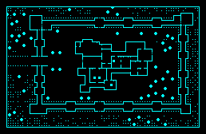
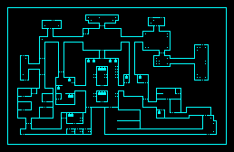
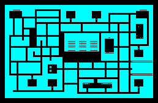

_Рекомендую прочесть оригинальное описание игры. Переведена только вводная часть (предистория) каждой миссии. Секции **VICTORY CONDITIONS** и **DEPLOYMENT** не переведены, а для миссий 2 и 3 цели отличаются от простого уничтожения всех противников._

---

## Описание миссий игры LASER SQUAD.
[ZX Pilot #02/96](https://zxpress.ru/article.php?id=7558)
(C) ДМИТРИЙ УСМАНОВ

### SCENARIO ONE: THE ASSASSINS (убийцы).

[сканер крупно](../images/screens/mission-1-map.png "сканер в масштабе 2:1")

Главарь банды наемных убийц засел у себя на вилле в горах, которая больше напоминает крепость. Зная, что ему угрожает, главарь окружил себя боевыми дроидами, вооруженными бластерами и управляемыми дистанционно.

В боевую группу вошли пять человек, задача - уничтожить главаря, дроиды в расчет не берутся.

_Советую Вам не высаживать десант между двойными стенами виллы, так как двери на этих стенах бронированные и открыть их можно только взорвав или расплавив тяжелым лазером. Против стен виллы очень хорошо применять ракетницу._

---

### SCENARIO TWO: MOONBASE ASSAULT (штурм лунной базы).

[сканер крупно](../images/screens/mission-2-map.png "сканер в масштабе 2:1")

Это, пожалуй, самый интересный уровень, особенно для игры вдвоем.

Корпорация "Всеобъемлющая", разбогатев на производстве наркотиков, настолько проникла во все сферы мировой торговли, что всерьез угрожала нормальному обмену товаров, навязывая всем свои условия. Операция по ликвидации преступной корпорации была долгой и сложной, так как для своих нужд "OMNI CORP" владела даже небольшой армией. Но все таки полиции удалось одержать верх, лишь небольшая группа преступников сумела захватить лунную базу и забаррикадироваться там. Задачу выбить их оттуда поручили восьмерым отважным бойцам из "Лазерного отделения".

_Обратите внимание на то, что стены лунной базы сделаны из жаростойкого ударопрочного сплава, пробить который не удастся._

---

### SCENARIO THREE: RESCUE FROM THE MINES (спасение из шахт).

[сканер крупно](../images/screens/mission-3-map.png "сканер в масштабе 2:1")

Директора корпорации "Металликс" уличили в крупнейших махинациях. Чтобы арестовать его, на астероид, где находилась резиденция директора, была выслана группа из трех человек отделения. Директора на астероиде не оказалось, зато там окасалась целая армия его охранников, которым удалось захватить троих ребят в плен и даже требовать выкуп. С заданием освободить своих солдат и уничтожить противника на астероид отправляется группа еще из пяти человек.

Астероид был изрыт в поисках полезных ископаемых и превратился в гигантский лабиринт, в котором за дверьми из вольфрам-ваннадиевого сплава томятся захваченные в плен заложники, причем основной группе не удалось заранее узнать их расположение; неизвестно оно и противнику. Двери можно взорвать лишь пластиковой взрывчаткой или выстрелом из ракетницы.

Лабиринт большой, но в нем повсюду установлены видеокамеры, информация от которых стекается на единственный в шахтах монитор. Забрав у одного из охранников ключ включения монитора, можно подключиться к системе и узнать расположение солдат противника (только для игры с компьютером).

Отметим, что бандитам для присуждения победы достаточно уничтожить пять любых нападающих.
